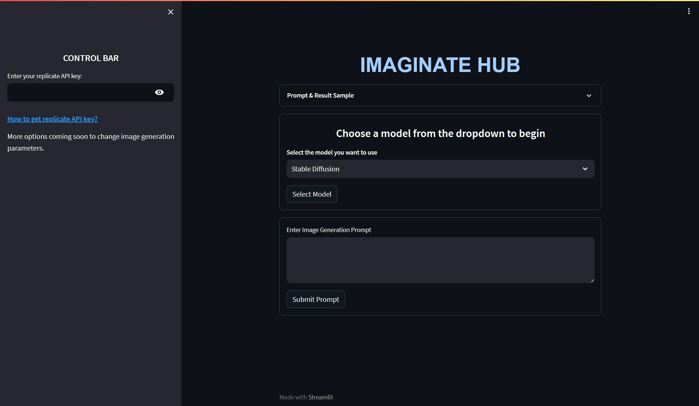

# IMAGINATE HUB

Welcome to Imaginate Hub, a state-of-the-art image generation platform where imagination meets machine learning. Utilizing advanced models, this app offers a seamless experience for users to input prompts and visualize the resulting images.

🚀 **Explore Live Application**: Dive into the Imaginate Hub experience right now! Check out the [Live Model Here](https://image-generator-app.streamlit.app/).

 

## Features

- **User-friendly Interface**: An intuitive, clean UI allowing you to focus on creativity.
  
- **Model Variety**: Choose from several image generation models: "Stable Diffusion", "Anything-v4.0", "Waifu Diffusion", and "Vintedios Diffusion".
  
- **Rapid Image Generation**: Simply type in your desired prompt and watch the magic happen.

## Detailed Steps for Usage

1. **Launch the App**: Navigate to the application URL or start the Streamlit app.

2. **Sample Preview**: For insights on what to expect, click on the **"Prompt & Result Sample"** section to view a sample prompt and the resultant image.

3. **Model Selection**:
    - Navigate to the dropdown menu.
    - Select your desired image generation model.

4. **API Key Configuration**:
    - Locate the sidebar on the left.
    - Input your Replicate API key into the provided field. If you don't have one, you can obtain it by [following this guide](https://gist.github.com/MonishSoundarRaj/76d1d6ef9a806d879ef4357ae5111f00).

5. **Input Your Prompt**:
    - In the main section, locate the text area labeled "Enter Image Generation Prompt".
    - Type in your creative prompt.

6. **Generate Image**:
    - Click the "Submit Prompt" button.
    - Give the system a moment to process.
    - Once completed, the generated image will display on screen.

7. **Download the Result**:
    - Below the generated image, there will be an option to download it for personal use.

## Requirements

- Streamlit
- Replicate
- os module
- requests

## Installation

To set up and run Imaginate Hub on your own system:

1. Clone this repository:
```
git clone https://github.com/MonishSoundarRaj/image-generator-streamlit
```

2. Navigate to the project directory:
```
cd iamge-generator-streamlit
```

3. Install the required Python packages:
```
pip install -r requirements.txt
```

4. Run the Streamlit app:
```
streamlit run app.py
```

## License

This project falls under the MIT License. For more details, please check the [LICENSE](LICENSE) file.

